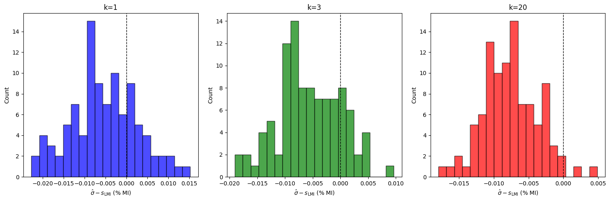
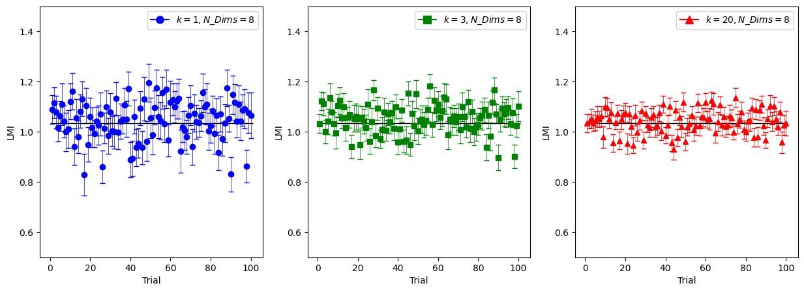
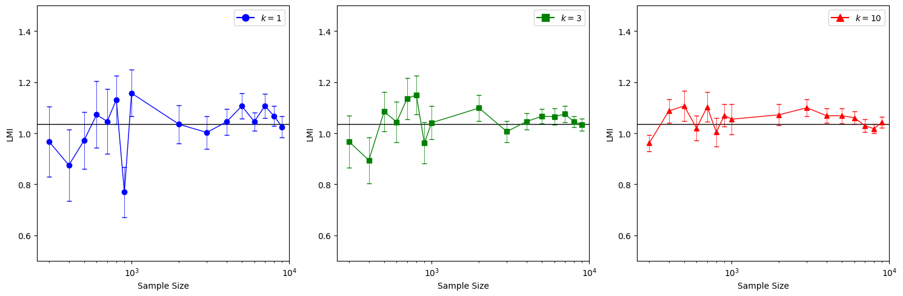
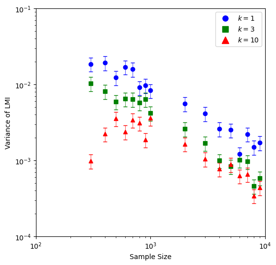

## Overview

Mutual information estimators are hard to put error bars on; the naive approach — bootstrap resampling — fails for MI because resampling with replacement creates duplicate points. Duplicates sit at zero distance from one another, which systematically positively biases KSG estimates. `estimate_variance()` therefore uses the **subsampling / partitioning** approach of Holmes & Nemenman (2019) rather than a bootstrap.

## How it works

The method exploits the fact that, for a KSG-style estimator, the variance of an MI estimate scales predictably with the inverse of the sample size:

$$\sigma^2_{KSG}(N) = \frac{B}{N}$$

The goal is to recover the coefficient $B$. Once $B$ is known, the variance at the full sample size $N$ follows directly.

The procedure is:

1. **Partition the data.** The `N` paired samples are split into `n_partitions` disjoint subsamples of size $N_i = N / n_i$, for a range of partition counts $n_i$ (e.g. 2, 3, 4, …, 9). Because the subsamples are disjoint rather than resampled, no duplicate points are introduced.

2. **Estimate MI in each subsample.** The MI for every partition is estimated to give a spread of estimates for each subsample size. The sample variance across partitions of a given size is

$$\sigma^2_{KSG,i} = \frac{1}{n_i - 1} \sum_{j=1}^{n_i} (\hat{I}_j - \bar{I})^2$$

3. **Fit the coefficient B.** Each $\sigma^2_{KSG,i}$ is (approximately) $\chi^2$-distributed with $n_i - 1$ degrees of freedom. Combining the partition variances through a $\chi^2$ likelihood function yields a maximum-likelihood estimate of $B$, and with it both $\sigma^2_{KSG}(N)$ and the variance (standard error) of that estimate.

4. **Apply to LMI.** This whole pipeline runs on the learned latent representations that LMI produces, so the returned $\sigma^2_{LMI}$ is the error estimate for the latent MI value.

## Benchmarking

The estimator was validated on synthetic data where the ground-truth mutual information is known, so that both the LMI estimate and its error bar could be checked directly.

**Test setup.** A correlated 1-D pair $(x, y)$ was drawn from a bivariate Gaussian (covariance `[[6, 4], [4, 3.5]]`, $\rho = 0.87$) with a known true MI of **1.035 bits**, then embedded into 100 dimensions each by multiplying against high-dimensional Gaussian noise. This produces a high-dimensional dataset with a known low-dimensional information content. The experiment drew **100 independent trials of 2,000 samples** each and compared:

1. the *observed* sample variance of the LMI estimates across trials against the *predicted* $\sigma^2_{LMI}$, and
2. the LMI estimates themselves against the known true MI.

### Results

**The predicted variance $\sigma^2_{LMI}$ is unbiased.** A z-test was used to compare the predicted variance against the observed sample variance across trials:

$$z_{\hat{\sigma}} = \frac{\bar{\sigma}^2 - s^2_{LMI}}{s_{\hat{\sigma}}/\sqrt{100}}$$

The predicted standard deviation closely tracked the observed scatter, giving only small biases across the tested neighbor counts ($z_{\hat{\sigma}} = -0.107, -0.104, -0.135$ for $k = 1, 3, 20$).

*Difference $\hat{\sigma} - s_{LMI}$ across 100 trials. The x-axis is expressed as a fraction of the true mutual information; the dashed line marks zero (no bias).*

**The LMI estimate is fairly unbiased.** Normalizing each trial's error by its predicted standard deviation,

$$z_j = \frac{\hat{I}_j - I}{\hat{\sigma}_j}, \quad 1 \le j \le 100,$$

gives an expected value close to 0 (for reference, the SEM is $1/\sqrt{100} = 0.1$) and a variance close to 1, the values expected if the error bars are well-calibrated.

| | k = 1 | k = 3 | k = 20 |
| --- | --- | --- | --- |
| $E[z_j]$ | 0.139 | 0.336 | 0.174 |
| $\mathrm{Var}[z_j]$ | 1.102 | 1.170 | 1.260 |

*The 100 LMI estimates (with predicted error bars) compared against the ground-truth MI (horizontal line).*

**LMI stays relatively unbiased as $k$ changes.** As sample size increases, the LMI estimate remains close to the true MI across neighbor counts.

*As sample size increases, LMI stays fairly unbiased across $k$.*

**Variance shrinks with sample size as expected.** Across sample sizes from ~300 to ~10,000, the variance of LMI decreased steadily, consistent with the $B/N$ scaling the method assumes. Larger $k$ also lowers variance for distributions with less detailed structure.

*Variance of LMI versus sample size. As sample size increases the variance goes down, and larger $k$ further reduces it.*

In short: LMI estimates are fairly unbiased, and the Holmes-style variance estimate produced by `estimate_variance()` closely matches the variance observed empirically.

## Example application

The same machinery was used to put error bars on a real high-dimensional estimate — the mutual information between ProtTrans (1024-D) embeddings of known ligand–receptor pairs (~4,400 samples), yielding an LMI estimate of **2.749 ± 0.056 bits**.

A caveat worth keeping in mind: LMI behaves like a metal detector. It tells you *how strong* a relationship is between high-dimensional variables and where to look, but not *what* that relationship is — it does not reveal the nature of the dependence.

## References

- C. M. Holmes and I. Nemenman, "Estimation of Mutual Information for Real-Valued Data with Error Bars and Controlled Bias," *Physical Review E*, vol. 100, no. 2, p. 022404, 2019.
- A. Kraskov, H. Stögbauer, and P. Grassberger, "Estimating Mutual Information," *Physical Review E*, vol. 69, no. 6, p. 066138, 2004.
- G. Gowri, X.-K. Lun, A. M. Klein, and P. Yin, "Approximating Mutual Information of High-Dimensional Variables Using Learned Representations," 2024.
